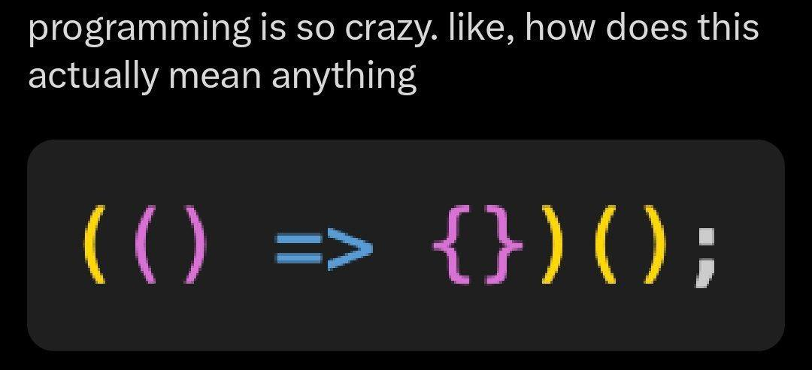

<p align="center">
  
</p>

# ES6 Basics

> From `var` chaos to ES6 zen — one arrow function at a time.

---

## 📝 Description

This project is my deep dive into ES6 (ECMAScript 2015), the version of JavaScript that changed everything. Through a series of progressive exercises, I explored the new syntax and features introduced in ES6, from block-scoped variables and arrow functions to iterators and template literals. Each task is designed to replace old JavaScript habits with cleaner, more modern patterns — and honestly, once you go ES6, you never go back.

---

## 🎯 Learning Objectives

By the end of this project, I am able to explain what ES6 is and why it represents a major milestone in the evolution of JavaScript. I understand the new features introduced in ES6 and how they improve code readability and maintainability. I can clearly articulate the difference between a constant (`const`) and a variable (`let` or `var`), and I know when to use each one appropriately. I am comfortable working with block-scoped variables to avoid the classic pitfalls of `var` hoisting. I can write arrow functions and apply default parameter values to make function signatures more expressive and concise. I know how to use rest parameters to handle a variable number of arguments, and spread syntax to expand arrays and strings. I can leverage template literals to build readable, dynamic strings without the string concatenation mess. I understand ES6 object creation patterns, including shorthand property syntax, computed property names, and method shorthand. Finally, I am able to work with iterators and `for...of` loops to traverse collections in a clean and modern way.

---

## 🛠️ Technologies Used

This project is written entirely in JavaScript (ES6+), interpreted with Node.js 20.x.x. I used Jest as the testing framework to validate each function's behavior, Babel (via `babel-jest` and `@babel/preset-env`) to transpile modern JS for compatibility, and ESLint with the Airbnb base configuration to keep my code clean and consistent. Scripts are managed through npm 9.x.x.

---

## ⚙️ Requirements

- **OS:** Ubuntu 20.04 LTS
- **Runtime:** Node.js `20.x.x` / npm `9.x.x`
- **Allowed editors:** `vi`, `vim`, `emacs`, `Visual Studio Code`
- All files must end with a new line
- All source files must use the `.js` extension
- All functions must be exported
- Code is tested with [Jest](https://jestjs.io/) and linted with [ESLint](https://eslint.org/) (Airbnb base rules)
- A `README.md` at the root of the project folder is mandatory
- The `node_modules/` folder must **not** be pushed to the repository

---

## 🚀 Installation

**1. Install Node.js 20.x.x** (from your home directory):

```bash
curl -sL https://deb.nodesource.com/setup_20.x -o nodesource_setup.sh
sudo bash nodesource_setup.sh
sudo apt install nodejs -y
```

Verify installation:

```bash
nodejs -v   # v20.x.x
npm -v      # 9.x.x or 10.x.x
```

**2. Clone the repository and navigate to the project:**

```bash
git clone https://github.com/GwenP88/holbertonschool-web_back_end.git
cd holbertonschool-web_back_end/ES6_basic
```

**3. Install project dependencies** (Jest, Babel, ESLint):

```bash
npm install
```

**4. Create the required configuration files** at the root of the project directory:

- `package.json`
- `babel.config.js`
- `.eslintrc.js`

> See the project intranet for the exact contents of each configuration file.

---

## ▶️ Usage / Execution

**Run a specific file with Babel:**

```bash
npm run dev <filename>.js
# Example:
npm run dev 0-main.js
```

**Run all tests:**

```bash
npm run test
```

**Run linter + tests together:**

```bash
npm run full-test
```

**Run linter only:**

```bash
npm run check-lint
```

---

## 📊 Project Progress

<p align="center">

</p>

<p align="center">
<sub>Mandatory tasks completion: 100% — Advanced tasks completion: 100%</sub>
</p>

---

## ✨ Features

### Task 0 - Const or let?

- **Status:** Mandatory
- **Objective:** Understand when to use `const` vs `let` by modifying two existing functions.
- **Constraint:** Replace all `var` declarations — use `const` in `taskFirst` and `let` in `taskNext`.
- **Expected behavior:** `taskFirst()` returns `'I prefer const when I can.'` and `taskNext()` returns `'But sometimes let is okay'`.

**Files:** `0-constants.js`

---

### Task 1 - Block Scope

- **Status:** Mandatory
- **Objective:** Fix variable scoping issues caused by `var` inside a conditional block.
- **Constraint:** Replace `var` with block-scoped declarations so that variables inside the `if` block don't overwrite the outer ones.
- **Expected behavior:** `taskBlock(true)` and `taskBlock(false)` both return `[ false, true ]`.

**Files:** `1-block-scoped.js`

---

### Task 2 - Arrow Functions

- **Status:** Mandatory
- **Objective:** Rewrite a standard function using ES6 arrow syntax to properly capture `this`.
- **Constraint:** The `add` function inside `getNeighborhoodsList` must be rewritten as an arrow function (no more `self = this` workaround).
- **Expected behavior:** `addNeighborhood('Noe Valley')` returns `[ 'SOMA', 'Union Square', 'Noe Valley' ]`.

**Files:** `2-arrow.js`

---

### Task 3 - Parameter Defaults

- **Status:** Mandatory
- **Objective:** Simplify a function by replacing manual `undefined` checks with ES6 default parameter values.
- **Constraint:** The entire function body must fit on a single line.
- **Expected behavior:** `getSumOfHoods(34)` returns `142`, `getSumOfHoods(34, 3)` returns `56`, `getSumOfHoods(34, 3, 4)` returns `41`.

**Files:** `3-default-parameter.js`

---

### Task 4 - Rest Parameter Syntax for Functions

- **Status:** Mandatory
- **Objective:** Use the rest parameter syntax (`...args`) to count the number of arguments passed to a function.
- **Constraint:** The function must use rest syntax — no `arguments` object allowed.
- **Expected behavior:** `returnHowManyArguments("one")` returns `1`; `returnHowManyArguments("one", "two", 3, "4th")` returns `4`.

**Files:** `4-rest-parameter.js`

---

### Task 5 - The Wonders of Spread Syntax

- **Status:** Mandatory
- **Objective:** Use spread syntax to concatenate two arrays and expand a string into individual characters.
- **Constraint:** The function body must be a single line.
- **Expected behavior:** `concatArrays(['a', 'b'], ['c', 'd'], 'Hello')` returns `[ 'a', 'b', 'c', 'd', 'H', 'e', 'l', 'l', 'o' ]`.

**Files:** `5-spread-operator.js`

---

### Task 6 - Take Advantage of Template Literals

- **Status:** Mandatory
- **Objective:** Rewrite a string return statement using ES6 template literals instead of concatenation.
- **Constraint:** The return value must use backtick syntax with `${}` interpolation.
- **Expected behavior:** Returns a clean, interpolated description of San Francisco's economy.

**Files:** `6-string-interpolation.js`

---

### Task 7 - Object Property Value Shorthand Syntax

- **Status:** Mandatory
- **Objective:** Use ES6 property shorthand to simplify an object where keys and variable names are identical.
- **Constraint:** Replace `income: income` style with just `income` shorthand.
- **Expected behavior:** `getBudgetObject(400, 700, 900)` returns `{ income: 400, gdp: 700, capita: 900 }`.

**Files:** `7-getBudgetObject.js`

---

### Task 8 - No Need to Create Empty Objects Before Adding in Properties

- **Status:** Mandatory
- **Objective:** Use ES6 computed property names to build an object with dynamic keys in a single expression.
- **Constraint:** The `budget` object must be created using computed property names — no empty object + assignment pattern.
- **Expected behavior:** Returns an object like `{ 'income-2021': 2100, 'gdp-2021': 5200, 'capita-2021': 1090 }`.

**Files:** `8-getBudgetCurrentYear.js`

---

### Task 9 - ES6 Method Properties

- **Status:** Mandatory
- **Objective:** Rewrite object methods using ES6 method property shorthand syntax.
- **Constraint:** Replace `functionName: function(...) {}` with `functionName(...) {}` shorthand inside the object literal.
- **Expected behavior:** `getIncomeInDollars(20)` returns `'$20'`; `getIncomeInEuros(20)` returns `'20 euros'`.

**Files:** `9-getFullBudget.js`

---

### Task 10 - For...of Loops

- **Status:** Mandatory
- **Objective:** Rewrite a function that uses `for...in` with `var` to use ES6's `for...of` loop and `const`/`let`.
- **Constraint:** No `var`, no `for...in` — use only `for...of` with block-scoped variables.
- **Expected behavior:** `appendToEachArrayValue(['appended', 'fixed', 'displayed'], 'correctly-')` returns `[ 'correctly-appended', 'correctly-fixed', 'correctly-displayed' ]`.

**Files:** `10-loops.js`

---

### Task 11 - Iterator

- **Status:** Mandatory
- **Objective:** Write a function that creates an object mapping a department name to an array of employee names.
- **Constraint:** The function must use a computed property name (`[departmentName]`) to build the object dynamically.
- **Expected behavior:** `createEmployeesObject("Software", ["Bob", "Sylvie"])` returns `{ Software: [ 'Bob', 'Sylvie' ] }`.

**Files:** `11-createEmployeesObject.js`

---

### Task 12 - Let's Create a Report Object

- **Status:** Mandatory
- **Objective:** Write a function that builds a report object containing all employees organized by department, plus a method to count departments.
- **Constraint:** Use spread syntax and ES6 method shorthand. The `getNumberOfDepartments` method must be a method property.
- **Expected behavior:** Returns an object with `allEmployees` (departments + staff) and `getNumberOfDepartments()` returning the count of departments.

**Files:** `12-createReportObject.js`

---

### Task 13 - Iterating through Report Objects

- **Status:** Advanced ⭐
- **Objective:** Write a function that returns a custom iterator to traverse all employees across all departments in a report object.
- **Constraint:** The function must return an iterable object that can be used in a `for...of` loop.
- **Expected behavior:** Iterating over the result of `createIteratorObject(report)` yields each employee name one by one (`Bob`, `Jane`, `Sylvie`).

**Files:** `100-createIteratorObject.js`

---

### Task 14 - Iterate through Object

- **Status:** Advanced ⭐
- **Objective:** Write a function that uses a report iterator to return all employee names joined into a single string separated by `|`.
- **Constraint:** Use the iterator returned by `createIteratorObject` — do not re-access the raw object structure.
- **Expected behavior:** `iterateThroughObject(reportWithIterator)` returns `'Bob | Jane | Sylvie'`.

**Files:** `101-iterateThroughObject.js`

---

## 🤝 Contributions & Acknowledgements

Big thanks to the Holberton School team for the well-structured curriculum and the (sometimes humbling) task descriptions. Thanks also to the JavaScript community for writing enough Stack Overflow answers to keep us all sane. No AI was harmed in the making of this README. 🙂

---

## 👤 Author

**Gwenaelle PICHOT**
- Student at Holberton School
- Track: `holbertonschool-web_back_end`
- Project: ES6 Basics