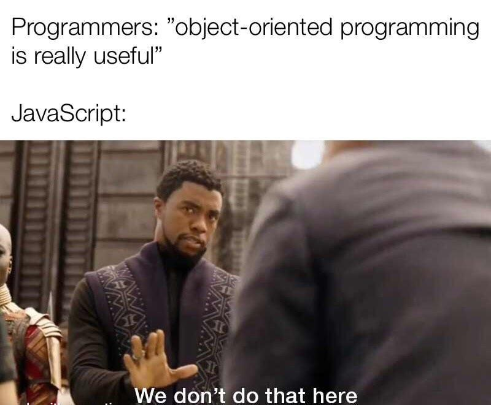

<p align="center">
  
</p>

# ES6 Classes

> *Because sometimes, objects just need a little more structure in their lives.*

---

## 📝 Description

This project is part of my back-end web development curriculum at Holberton School. It dives deep into one of ES6's most powerful features: **classes**. Through a series of progressive tasks, I explore how to define classes, use constructors, implement getters and setters, apply inheritance, work with static methods, and even dabble in metaprogramming with Symbols. By the end, I had a solid understanding of how JavaScript handles object-oriented programming — and a newfound appreciation for clean, structured code.

---

## 🎯 Learning Objectives

By completing this project, I am able to explain clearly how to define a class in JavaScript using the ES6 `class` syntax. I understand how to add methods directly inside a class and how to distinguish instance methods from static methods — and more importantly, *why* you'd want a static method in the first place. I learned how to extend a class from another using `extends` and `super`, enabling clean inheritance hierarchies. I also explored metaprogramming concepts, including how Symbols can be used to customize object behavior in subtle but powerful ways, such as overriding `Symbol.toPrimitive` or `Symbol.toStringTag`.

---

## 🛠️ Technologies Used

This project is written entirely in **JavaScript (ES6+)**, interpreted with **Node.js 20.x**. I use **Babel** to transpile modern JS syntax and **Jest** for unit testing. Code quality is enforced with **ESLint** using the Airbnb base configuration. Everything runs on **Ubuntu 20.04 LTS**.

---

## ⚙️ Requirements

- OS: Ubuntu 20.04 LTS
- Node.js: `v20.x.x`
- npm: `v9.x.x` or higher
- Allowed editors: `vi`, `vim`, `emacs`, `Visual Studio Code`
- All files must use the `.js` extension and end with a new line
- Code must pass all Jest tests (`npm run test`) and ESLint linting (`npm run full-test`)

---

## 🚀 Installation

**1. Clone the repository:**
```bash
git clone https://github.com/GwenP88/holbertonschool-web_back_end.git
cd holbertonschool-web_back_end/ES6_classes
```

**2. Install Node.js 20.x.x** (in your home directory):
```bash
curl -sL https://deb.nodesource.com/setup_20.x -o nodesource_setup.sh
sudo bash nodesource_setup.sh
sudo apt install nodejs -y
```

**3. Install project dependencies:**
```bash
npm install
```

This installs Jest, Babel, and ESLint automatically from the `package.json`.

---

## ▶️ Usage / Execution

**Run a specific file:**
```bash
npm run dev <filename>.js
# Example:
npm run dev 0-main.js
```

**Run all tests:**
```bash
npm run test
```

**Run tests + linting (full check):**
```bash
npm run full-test
```

---

## 📊 Project Progress

<p align="center">

</p>

<p align="center">
<sub>Mandatory tasks completion: 100% — Advanced tasks completion: 100%</sub>
</p>

---

## ✨ Features

---

### Task 0 - You used to attend a place like this at some point
**Status:** Mandatory

**Objective:** Define my first ES6 class with a constructor and a stored attribute.

**Constraint:** The attribute `maxStudentsSize` must be stored as `_maxStudentsSize`.

**Expected behavior:** `new ClassRoom(10)` creates an instance with `_maxStudentsSize` set to `10`.

**Files:** `0-classroom.js`

---

### Task 1 - Let's make some classrooms
**Status:** Mandatory

**Objective:** Use the `ClassRoom` class to create and return an array of instances with predefined sizes.

**Constraint:** Must return exactly 3 `ClassRoom` objects with sizes `19`, `20`, and `34`, in that order.

**Expected behavior:** `initializeRooms()` returns an array of 3 `ClassRoom` instances.

**Files:** `1-make_classrooms.js`

---

### Task 2 - A Course, Getters, and Setters
**Status:** Mandatory

**Objective:** Build a class with type-validated attributes and proper getters/setters.

**Constraint:** Each attribute (`name`, `length`, `students`) must be validated by type on assignment. Incorrect types throw a `TypeError`.

**Expected behavior:** Getters return the stored value; setters validate and update it; wrong types throw descriptive errors.

**Files:** `2-hbtn_course.js`

---

### Task 3 - Methods, static methods, computed methods names..... MONEY
**Status:** Mandatory

**Objective:** Implement a `Currency` class with getters, setters, and a display method.

**Constraint:** The `displayFullCurrency()` method must return the string in the format `name (code)`.

**Expected behavior:** `new Currency('$', 'Dollars').displayFullCurrency()` returns `"Dollars ($)"`.

**Files:** `3-currency.js`

---

### Task 4 - Pricing
**Status:** Mandatory

**Objective:** Combine two classes, add instance and static methods.

**Constraint:** `displayFullPrice()` must use the `Currency` instance's name and code. `convertPrice()` is a static method that multiplies amount by rate.

**Expected behavior:** `p.displayFullPrice()` returns `"100 Euro (EUR)"`. `Pricing.convertPrice(100, 1.2)` returns `120`.

**Files:** `4-pricing.js`

---

### Task 5 - A Building
**Status:** Mandatory

**Objective:** Implement an abstract-like class that enforces method implementation in subclasses.

**Constraint:** Any subclass that does not override `evacuationWarningMessage` must throw an error: `Class extending Building must override evacuationWarningMessage`.

**Expected behavior:** Instantiating a subclass without that method throws an `Error`.

**Files:** `5-building.js`

---

### Task 6 - Inheritance
**Status:** Mandatory

**Objective:** Extend `Building` with a `SkyHighBuilding` class that overrides the evacuation message.

**Constraint:** Must call `super(sqft)` in the constructor and store `floors` as `_floors`. The overridden method must return `"Evacuate slowly the NUMBER floors"`.

**Expected behavior:** `building.evacuationWarningMessage()` returns the correct message with the number of floors.

**Files:** `6-sky_high.js`

---

### Task 7 - Airport
**Status:** Mandatory

**Objective:** Customize the string representation of a class using `Symbol.toStringTag`.

**Constraint:** The default `toString()` output must return `[object CODE]` where `CODE` is the airport code.

**Expected behavior:** `airportSF.toString()` returns `"[object SFO]"`.

**Files:** `7-airport.js`

---

### Task 8 - Primitive - Holberton Class
**Status:** Mandatory

**Objective:** Use `Symbol.toPrimitive` to control how a class is cast to a number or string.

**Constraint:** Casting to `Number` returns `size`; casting to `String` returns `location`.

**Expected behavior:** `Number(hc)` returns `12`; `String(hc)` returns `"Mezzanine"`.

**Files:** `8-hbtn_class.js`

---

### Task 9 - Hoisting
**Status:** Mandatory

**Objective:** Fix a broken file with hoisting issues and incorrect references.

**Constraint:** Classes must be declared before they are used. Constructor parameters and `self` references must be corrected to `this`.

**Expected behavior:** `listOfStudents` prints correctly with all student descriptions.

**Files:** `9-hoisting.js`

---

### Task 10 - Vroom
**Status:** Mandatory

**Objective:** Implement a `cloneCar` method using Symbols to return a new instance of the same class.

**Constraint:** `cloneCar()` must return a new object of the actual class (respecting inheritance), with all attributes set to `undefined`.

**Expected behavior:** `tc2 instanceof TestCar` is `true`; `tc1 == tc2` is `false`.

**Files:** `10-car.js`

---

### Task 11 - EVCar
**Status:** Advanced

**Objective:** Extend `Car` with an `EVCar` class that overrides `cloneCar` for privacy reasons.

**Constraint:** When `cloneCar` is called on an `EVCar` instance, it must return a plain `Car` instance — not an `EVCar` — to hide the range information.

**Expected behavior:** `ec2` is an instance of `Car`, not `EVCar`, and has all attributes set to `undefined`.

**Files:** `100-evcar.js`

---

## 🤝 Contributions & Acknowledgements

Big thanks to the Holberton School staff and peers who reviewed, debugged, and occasionally commiserated with me over a particularly stubborn hoisting bug. Open to feedback and pull requests — just be kind, I'm learning! 🙏

---

## 👤 Author

**Gwenaelle PICHOT**
Holberton School Student — Full-Stack Web Development
Project: ES6 Classes
GitHub: [@GwenP88](https://github.com/GwenP88)