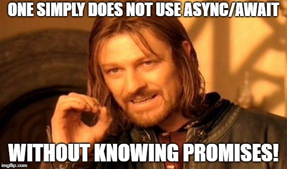

<p align="center">
  
</p>

# ES6 Promises

> Making (and keeping) asynchronous promises to JavaScript — one `then`, `catch`, and `await` at a time.

---

## 📝 Description

This project dives into asynchronous JavaScript through the lens of ES6 Promises. I explore how to create, resolve, reject, and chain promises, as well as how to handle multiple promises simultaneously using methods like `Promise.all` and `Promise.allSettled`. I also tackle error handling with `try/catch` and `throw`, and discover the elegance of `async/await` for writing asynchronous code that reads like synchronous code. The project is part of the Holberton School web back-end curriculum and runs on Node.js with Babel for ES6 transpilation.

---

## 🎯 Learning Objectives

At the end of this project, I am able to explain the following concepts without the help of Google. I understand what Promises are, why they exist, and how they solve the problem of callback hell in asynchronous JavaScript. I know how to use the `then`, `resolve`, and `catch` methods to handle promise outcomes, and I am comfortable using every method available on the Promise object, including `Promise.all`, `Promise.allSettled`, and `Promise.race`. I am also able to use `throw` and `try/catch` to handle errors gracefully in both synchronous and asynchronous contexts. Finally, I know how the `await` operator works and how to write `async` functions to make asynchronous code cleaner and more readable.

---

## 🛠️ Technologies Used

This project is written entirely in JavaScript (ES6+) and runs on Node.js. I use Babel (`@babel/core`, `@babel/preset-env`, `@babel/cli`) to transpile modern ES6 syntax, and `babel-jest` along with Jest for unit testing. ESLint with the Airbnb base configuration is used to enforce code style and quality. The project is managed with npm, and scripts are executed via `npm run dev` using `babel-node`.

---

## ⚙️ Requirements

- **OS:** Ubuntu 20.04 LTS
- **Runtime:** Node.js `20.x.x` — npm `9.x.x`
- **Allowed editors:** `vi`, `vim`, `emacs`, `Visual Studio Code`
- All files must end with a new line
- A `README.md` file at the root of the project folder is mandatory
- All code files must use the `.js` extension
- All functions must be exported
- Code is tested using **Jest** via `npm run test`
- Code is linted using **ESLint**
- The entire project (tests + lint) can be verified with `npm run full-test`

### Setup — Install Node.js 20.x.x

Run the following in your home directory:

```bash
curl -sL https://deb.nodesource.com/setup_20.x -o nodesource_setup.sh
sudo bash nodesource_setup.sh
sudo apt install nodejs -y
```

Verify the installation:

```bash
nodejs -v   # v20.15.1
npm -v      # 10.7.0
```

### Install Jest, Babel, and ESLint

In your project directory:

```bash
npm install --save-dev jest
npm install --save-dev babel-jest @babel/core @babel/preset-env @babel/cli
npm install --save-dev eslint
```

> Don't forget to run `npm install` once you have the `package.json` in place.

---

## 🚀 Installation

```bash
git clone https://github.com/GwenP88/holbertonschool-web_back_end.git
cd holbertonschool-web_back_end/ES6_promise
npm install
```

---

## ▶️ Usage / Execution

All JavaScript files can be executed using the `npm run dev` script with Babel transpilation:

```bash
npm run dev <main_file>.js
```

For example:

```bash
npm run dev 0-main.js
```

To run the test suite:

```bash
npm test
```

---

## 📊 Project Progress

<p align="center">
  
</p>
<p align="center">
  <sub>Mandatory tasks completion: 100% --- Advanced tasks completion: 100%</sub>
</p>

---

## ✨ Features

---

**Task 0 - Keep every promise you make and only make promises you can keep**

- **Status:** Mandatory
- **Objective:** Create a `getResponseFromAPI` function that returns a Promise.
- **Constraint:** The function must return an actual `Promise` instance.
- **Expected behavior:** `response instanceof Promise` evaluates to `true`.
- **Files:** `0-promise.js`

---

**Task 1 - Don't make a promise...if you know you can't keep it**

- **Status:** Mandatory
- **Objective:** Create a `getFullResponseFromAPI(success)` function that returns a resolved or rejected promise based on a boolean argument.
- **Constraint:** Resolves with `{ status: 200, body: 'Success' }` when `true`; rejects with an error message when `false`.
- **Expected behavior:** Returns a resolved promise for `true` and a rejected promise with an error for `false`.
- **Files:** `1-promise.js`

---

**Task 2 - Catch me if you can!**

- **Status:** Mandatory
- **Objective:** Create a `handleResponseFromAPI(promise)` function that appends resolve, reject, and finally handlers to a given promise.
- **Constraint:** Returns `{ status: 200, body: 'success' }` on resolve, an empty `Error` on reject, and always logs `Got a response from the API`.
- **Expected behavior:** Logs the API response message for every resolution regardless of outcome.
- **Files:** `2-then.js`

---

**Task 3 - Handle multiple successful promises**

- **Status:** Mandatory
- **Objective:** Create a `handleProfileSignup` function that resolves `uploadPhoto` and `createUser` simultaneously and logs the combined result.
- **Constraint:** Must use `Promise.all`; logs `Signup system offline` on error.
- **Expected behavior:** Logs `photo-profile-1 Guillaume Salva` when both promises resolve successfully.
- **Files:** `3-all.js`

---

**Task 4 - Simple promise**

- **Status:** Mandatory
- **Objective:** Create a `signUpUser(firstName, lastName)` function that returns a resolved promise containing the user's name attributes.
- **Constraint:** Always resolves; no rejection handling needed.
- **Expected behavior:** Returns `Promise { { firstName: 'Bob', lastName: 'Dylan' } }`.
- **Files:** `4-user-promise.js`

---

**Task 5 - Reject the promises**

- **Status:** Mandatory
- **Objective:** Create an `uploadPhoto(fileName)` function that returns a rejected promise with an error message.
- **Constraint:** The error message must follow the format `$fileName cannot be processed`.
- **Expected behavior:** Returns a rejected promise containing the formatted error string.
- **Files:** `5-photo-reject.js`

---

**Task 6 - Handle multiple promises**

- **Status:** Mandatory
- **Objective:** Create a `handleProfileSignup(firstName, lastName, fileName)` function that calls `signUpUser` and `uploadPhoto` and returns the settled results of both.
- **Constraint:** Must use `Promise.allSettled`; returns an array of `{ status, value }` objects for each promise.
- **Expected behavior:** Returns a pending promise that resolves to an array reflecting each promise's outcome.
- **Files:** `6-final-user.js`

---

**Task 7 - Load balancer**

- **Status:** Mandatory
- **Objective:** Create a `loadBalancer(chinaDownload, USDownload)` function that returns the value of whichever promise resolves first.
- **Constraint:** Must use `Promise.race`.
- **Expected behavior:** Returns the result of the fastest resolving promise between the two given downloads.
- **Files:** `7-load_balancer.js`

---

**Task 8 - Throw an error**

- **Status:** Mandatory
- **Objective:** Create a `divideFunction(numerator, denominator)` function that divides two numbers or throws an error when the denominator is zero.
- **Constraint:** Must throw `new Error('cannot divide by 0')` when denominator is `0`.
- **Expected behavior:** Returns the division result normally, or throws an error for division by zero.
- **Files:** `8-try.js`

---

**Task 9 - Throw error / try catch**

- **Status:** Mandatory
- **Objective:** Create a `guardrail(mathFunction)` function that executes a function, captures its return value or error message, and always appends `'Guardrail was processed'` to the result queue.
- **Constraint:** Must use `try/catch`; both the result (or error message) and the guardrail message are pushed to the same array.
- **Expected behavior:** Returns `[5, 'Guardrail was processed']` on success or `['Error: cannot divide by 0', 'Guardrail was processed']` on failure.
- **Files:** `9-try.js`

---

**Task 10 - Await / Async**

- **Status:** Advanced
- **Objective:** Create an `asyncUploadUser` async function that calls `uploadPhoto` and `createUser` from `utils.js` and returns a combined object with both results.
- **Constraint:** Must use `async/await`; returns `{ photo: null, user: null }` if any promise fails.
- **Expected behavior:** Returns `{ photo: { status: 200, body: 'photo-profile-1' }, user: { firstName: 'Guillaume', lastName: 'Salva' } }` on success.
- **Files:** `100-await.js`

---

## 🤝 Contributions & Acknowledgements

A big thank you to the Holberton School staff and peers who kept their promises — unlike some APIs I've dealt with in this project. Special thanks to `async/await` for making asynchronous code finally look like it was written by a human being.

---

## 👤 Author

**Gwenaelle PICHOT**

- Student at Holberton School
- Track: holbertonschool-web_back_end
- Project: ES6 Promises