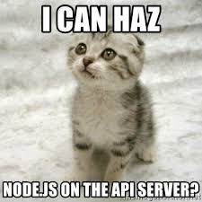

<p align="center">
  
</p>

# NodeJS Basics

> From `console.log` to a fully structured Express server — one step at a time.

---

## 📝 Description

This project is my introduction to backend development with Node.js. I explored how to run JavaScript on a server, read files, handle standard input, and build HTTP servers — first with Node's built-in `http` module, then with the Express framework. The final milestone involves organizing a full Express server into a clean MVC-like structure using controllers, routes, and utility functions, all powered by ES6 syntax thanks to Babel. It's the kind of project that turns "I've heard of Node" into "okay, I actually get it now."

---

## 🎯 Learning Objectives

By the end of this project, I am able to run JavaScript files using Node.js directly from the command line without a browser. I understand how to use built-in Node.js modules and how to leverage the `fs` module to read files both synchronously and asynchronously. I know how to use the `process` object to access command-line arguments and environment variables. I can create a basic HTTP server using Node's native `http` module as well as using the Express framework. I am able to define advanced routes with Express, including parameterized routes. I can use ES6 features like `import`/`export` in Node.js by configuring Babel, and I know how to use Nodemon to automatically restart my server during development without losing my mind.

---

## 🛠️ Technologies Used

This project is built entirely with JavaScript (ES6+), running on Node.js 20.x. I use Express as the web framework for building HTTP servers, and Babel (via `babel-node` and `babel-preset-env`) to enable ES6 module syntax in Node. Nodemon keeps the development loop fast by watching for file changes. Code quality is enforced with ESLint (Airbnb style guide), and tests are run with Mocha and Chai. The data source is a simple CSV file (`database.csv`) parsed manually — no database required.

---

## ⚙️ Requirements

- OS: Ubuntu 20.04 LTS
- Node.js version: `20.x.x`
- All files must end with a new line
- All source files use the `.js` extension
- A `README.md` at the root of the project is mandatory
- Code is tested using Mocha: `npm run test`
- Code is linted using ESLint: `npm run check-lint`
- Full validation (tests + lint): `npm run full-test`
- All functions/classes must be exported using: `module.exports = myFunction;`
- The following files must be present in the repository: `package.json`, `babel.config.js`, `.eslintrc.js`, `database.csv`
- Allowed editors: `vi`, `vim`, `emacs`, Visual Studio Code

---

## 🚀 Installation

```bash
git clone https://github.com/GwenP88/holbertonschool-web_back_end.git
cd holbertonschool-web_back_end/Node_JS_basic
npm install
```

---

## ▶️ Usage / Execution

### Running individual scripts

```bash
node 0-console.js
node 1-stdin.js
node 2-read_file.js
node 3-read_file_async.js
```

### Running HTTP servers (Node native)

```bash
node 4-http.js
node 5-http.js database.csv
```

### Running HTTP servers (Express)

```bash
node 6-http_express.js
node 7-http_express.js database.csv
```

### Running the full structured server with Nodemon + Babel

```bash
npm run dev
# or, if running from outside the full_server folder:
nodemon --exec babel-node --presets babel-preset-env ./full_server/server.js ./database.csv
```

Then test with:

```bash
curl localhost:1245 && echo ""
curl localhost:1245/students && echo ""
curl localhost:1245/students/CS && echo ""
curl localhost:1245/students/SWE && echo ""
```

### Running tests

```bash
npm run test
npm run full-test
```

---

## 📊 Project Progress

<p align="center">

</p>

<p align="center">
<sub>Mandatory tasks completion: 100%</sub>
</p>

---

## ✨ Features

### Task 0 - Executing basic javascript with Node JS

- **Status:** Mandatory
- **Objective:** Create a `displayMessage` function that prints a string to STDOUT.
- **Constraint:** The function must be exportable and callable from an external file.
- **Expected behavior:** `displayMessage("Hello NodeJS!")` prints `Hello NodeJS!` to the console.

**Files:** `0-console.js`

---

### Task 1 - Using Process stdin

- **Status:** Mandatory
- **Objective:** Write a CLI program that reads user input from stdin and responds with their name.
- **Constraint:** Must handle both interactive and piped input; must display a closing message when the stream ends.
- **Expected behavior:** Prompts for a name, echoes it back, and prints a closing message on program exit.

**Files:** `1-stdin.js`

---

### Task 2 - Reading a file synchronously with Node JS

- **Status:** Mandatory
- **Objective:** Create a `countStudents` function that reads `database.csv` synchronously and logs student counts per field.
- **Constraint:** Must throw an error with the message `Cannot load the database` if the file is unavailable. Empty lines must be ignored.
- **Expected behavior:** Logs total student count and per-field breakdown with first name lists.

**Files:** `2-read_file.js`

---

### Task 3 - Reading a file asynchronously with Node JS

- **Status:** Mandatory
- **Objective:** Rewrite `countStudents` to read the file asynchronously and return a Promise.
- **Constraint:** Must reject the Promise if the file is unavailable. Does not block the event loop.
- **Expected behavior:** Same output as Task 2, but non-blocking — `"After!"` prints before the student data.

**Files:** `3-read_file_async.js`

---

### Task 4 - Create a small HTTP server using Node's HTTP module

- **Status:** Mandatory
- **Objective:** Build a basic HTTP server using the native `http` module that responds to any endpoint.
- **Constraint:** Must listen on port `1245`. The app must be exported as `app`.
- **Expected behavior:** Any request to any URL returns `Hello Holberton School!` as plain text.

**Files:** `4-http.js`

---

### Task 5 - Create a more complex HTTP server using Node's HTTP module

- **Status:** Mandatory
- **Objective:** Extend the HTTP server to serve different content based on the URL path.
- **Constraint:** The database filename is passed as a command-line argument. Must handle `/` and `/students` routes.
- **Expected behavior:** `/` returns a greeting; `/students` returns the full student list from the CSV file.

**Files:** `5-http.js`

---

### Task 6 - Create a small HTTP server using Express

- **Status:** Mandatory
- **Objective:** Recreate the basic HTTP server using the Express framework.
- **Constraint:** Must listen on port `1245`. Only the `/` route is defined; all others return Express's default 404.
- **Expected behavior:** `GET /` returns `Hello Holberton School!`; other routes return an HTML error page.

**Files:** `6-http_express.js`

---

### Task 7 - Create a more complex HTTP server using Express

- **Status:** Mandatory
- **Objective:** Extend the Express server to handle both `/` and `/students` routes using the async CSV reader.
- **Constraint:** Database filename passed as CLI argument. Must reuse the async logic from Task 3.
- **Expected behavior:** Same behavior as Task 5 but built with Express routing.

**Files:** `7-http_express.js`

---

### Task 8 - Organize a complex HTTP server using Express

- **Status:** Mandatory
- **Objective:** Refactor the Express server into a structured MVC-like architecture using controllers, routes, and a utility module.
- **Constraint:** Must use ES6 `import`/`export` syntax with `babel-node`. The server must listen on port `1245`. The `/students/:major` route only accepts `CS` or `SWE` as values.
- **Expected behavior:**
  - `GET /` → `Hello Holberton School!`
  - `GET /students` → full student list sorted alphabetically by field
  - `GET /students/CS` or `/students/SWE` → filtered list for that field
  - `GET /students/French` (or any invalid major) → 500 error: `Major parameter must be CS or SWE`
  - If the database is unavailable → 500 error: `Cannot load the database`

**Files:** `full_server/utils.js`, `full_server/controllers/AppController.js`, `full_server/controllers/StudentsController.js`, `full_server/routes/index.js`, `full_server/server.js`

---

## 🤝 Contributions & Acknowledgements

Big thanks to the Holberton School curriculum for making me go from "what's a server?" to "I just built one with controllers and everything." Special mention to the Nodemon team for saving me from restarting the server manually every 30 seconds — you are the real MVP.

---

## 👤 Author

**Gwenaelle PICHOT**
- Student at Holberton School
- Track: holbertonschool-web_back_end
- Project: NodeJS Basics